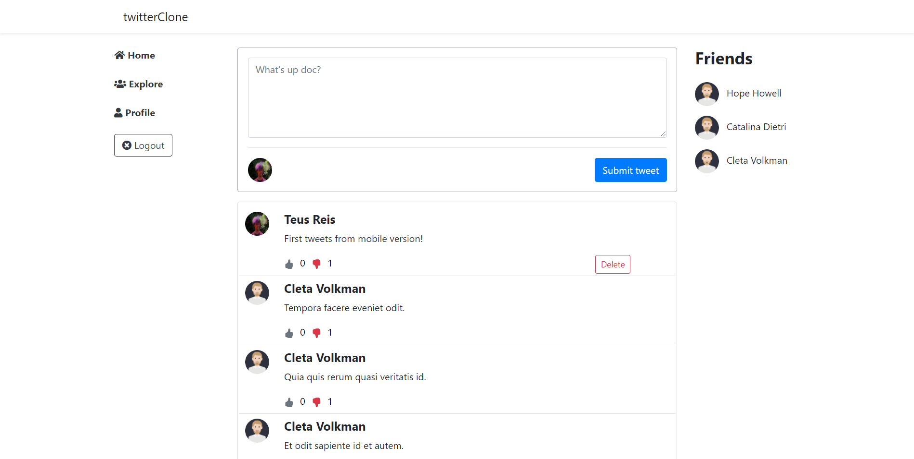

# Twitter Clone



## Description
---

This project is a clone of the twitter, built with laravel 8, which reproduce the twitter's layout, as also, some of its main functionalities!

## Main Features
---

- Post a tweet
- Create tweet
- Delete tweet
- Like and dislike a tweet
- Follow other users

## Requirements
---
- php: ^8.0
- Laravel: ^8.0
- Composer
- ext-pdo: *

## Installation and Setup
---

### Project Set up

1. First you need to clone this repo or download the zip and extract!
2. cd/get into your project
3. Install Composer Dependencies
```
composer install
```
4. Install NPM Dependencies
```
npm install
```
5. Create a copy of your .env file
```
cp .env.example .env
```
6. Generate an app encryption key
```
php artisan key:generate
```
7. Create an database for the application, and in the .env file, add database information
8. Migrate the database and seed the database
```
php artisan migrate --seed
```
